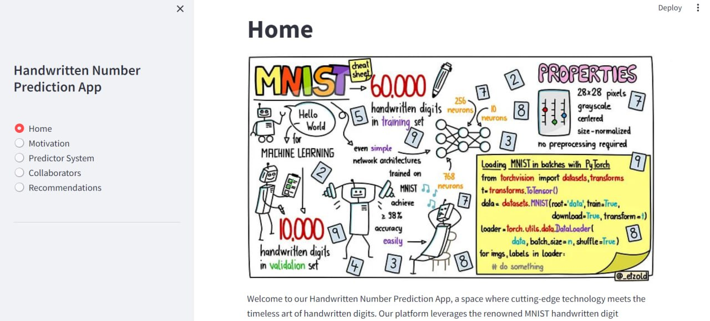
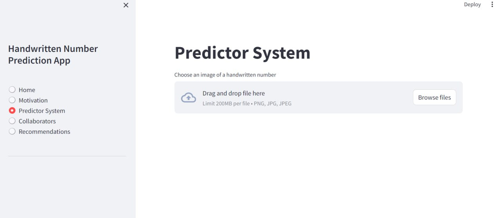
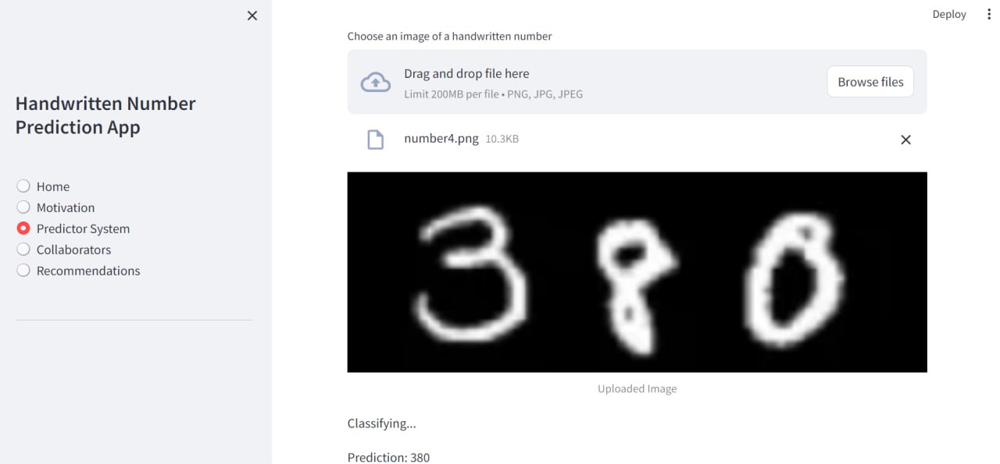
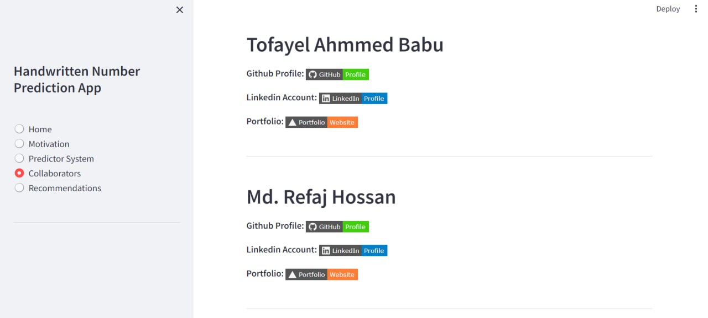
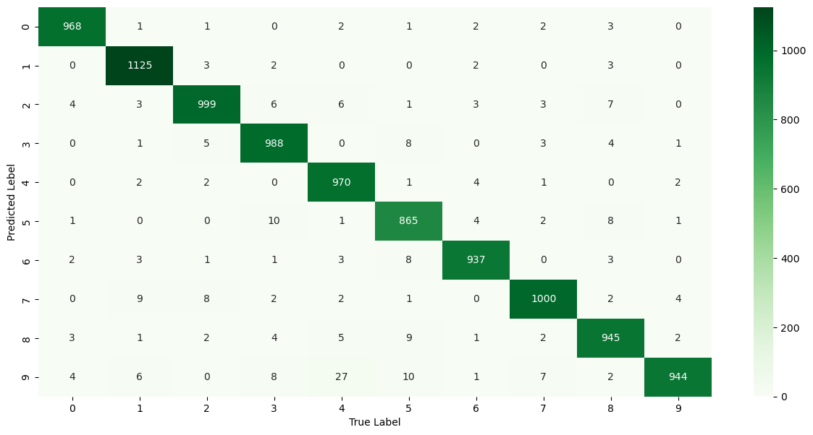
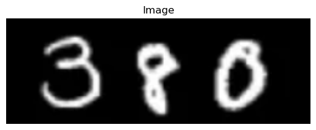

# DigitsInSight-Handwritten Number Predictor
An adept system for predicting handwritten numbers, leveraging the MNIST dataset comprising 60,000 training and 10,000 testing instances.

## Table of Contents
1. [Introduction](#1-introduction)
   - 1.1 [Motivation](#11-motivation)
   - 1.2 [Applications and Impacts](#12-applications-and-impacts)
2. [Project Overview](#2-project-overview)
   - 2.1 [Project Deployment](#21-project-deployment)
4. [Required Technologies](#3-required-technologies)
5. [System Implementation](#4-system-implementation)
6. [Conclusion](#5-conclusion)
7. [Future Recommendations](#6-future-recommendations)
8. [References](#7-references)

## 1 Introduction

In the realm of machine learning, the MNIST Handwritten Digit Classification to number 
prediction project stands as a pursuit aimed at crafting a proficient model capable of accurately 
identifying and classifying handwritten digits as well as numbers. At its core, this project aims at 
harnessing the potential of the MNIST dataset – a well-regarded repository of 28x28 pixel 
grayscale images featuring handwritten digits ranging from 0 to 9 where the training and testing 
size is of 60, 000 and 10, 000 respectively. The central objective is to implement a robust 
classification algorithm, one that possesses the ability to automatically discern and categorize 
distinct digits based on the nuanced pixel values within each image. That means, this project is all 
about teaching a computer to be smart with handwritten numbers. Our job is to train the computer 
to look at the pictures and say, "Oh, that's a 3!" or "Hey, that's a 7!" We're basically making the 
computer learn how to recognize and tell apart different numbers by looking at tiny dots that make 
up the pictures. It's like teaching the computer its own special way of reading our handwritten 
numbers.

## 1.1 Motivation

The motivation behind the MNIST Handwritten Digit Classification to number prediction project stems from its potential impact on daily life. By creating a smart system capable of recognizing handwritten numbers, the project aims to achieve the following major motivations:

1. **Automating Daily Tasks:**
   - Recognition of handwritten numbers extends to automating tasks like recognizing postal codes and digitizing historical documents, simplifying processes in daily life.

2. **Educational Playground:**
   - Serving as a valuable educational playground for learners, the project offers a fun and hands-on experience in exploring machine learning using the MNIST dataset. It becomes a platform for trying out different algorithms and gaining practical experience.

3. **Practical Impact on Services:**
   - The project's practical impact is evident in its potential to improve postal services. Creating a smart system for recognizing handwritten numbers contributes to the automation of tasks such as automatic postal code recognition and digitization of historical documents.

4. **Enhancing Technical Skills:**
   - For learners and enthusiasts, the project provides an opportunity to enhance technical skills and understanding in machine learning. It's about making technology smarter and more useful in everyday experiences.

The realization of these motivations underscores the project's significance in not only technological advancements but also in practical applications and educational growth.

## 1.2 Applications and Impacts

The developed model holds significant applications in various domains where accurate digit recognition is essential. The major applications include:

- **Optical Character Recognition (OCR):**
  - Handwritten digit classification serves as a foundational element in OCR systems. It plays a crucial role in recognizing and interpreting handwritten characters.

- **Finance:**
  - A robust digit classification model enhances the accuracy of financial systems. By reducing errors in manual digit entry, it contributes to the reliability of financial transactions.

- **Postal Services:**
  - Implementation of the digit classification model in postal services can automate the sorting process. This automation improves efficiency in handling mail, contributing to streamlined postal operations.

- **Educational Technology:**
  - Recognizing handwritten digits has applications in educational technology. It can be utilized for grading handwritten assignments, evaluating mathematical expressions, and providing feedback on handwritten solutions.

These applications showcase the versatility of the model, extending its utility to diverse fields where precise digit recognition is crucial.

## 2 Project Overview

The proposed project for handwritten digit classification to number detection incorporates several key features:

- **MNIST Dataset Utilization:**
  - Leveraging the MNIST dataset, which is a repository of testing images featuring handwritten digits ranging from 0 to 9. This dataset serves as a foundational element for training and testing the model.

- **Preprocessing Techniques:**
  - Employing preprocessing methods, including normalization and reshaping of images. This step is crucial for enhancing the model's efficiency by preparing the data for effective learning, ensuring optimal performance during training.

- **Traditional Machine Learning Models:**
  - Implementation of classical machine learning algorithms to classify handwritten digits. Although not used in this specific project, exploration of methods such as support vector machines or k-nearest neighbors for baseline comparisons can provide insights into the performance of deep learning models.

- **Deep Learning Models:**
  - Incorporating advanced deep learning techniques for more complex pattern recognition. Utilizing neural network architectures, such as convolutional neural networks (CNNs), to capture intricate features within the handwritten digit images.

These features collectively contribute to the development of a comprehensive system for accurate handwritten digit classification and number detection.

## 2.1 Project Deployment

The following figures represent the deployment of the project, showcasing its capability to predict numbers from handwritten images.

### Figure 01: Interface of Home Page

### Figure 02: Interface of Predictor Screen

The deployment interfaces illustrate the core functionality of predicting handwritten numbers based on given input images. These interfaces provide a user-friendly experience for interacting with the trained model.

### Figure 03: Interface of Predictor Screen (Including Prediction)

### Figure 04: Interface of Collaborator Screen

These figures collectively depict the user interfaces and the collaborative aspects of the deployed project, emphasizing its practical application in predicting numbers from handwritten images.

## 3 Required Technologies

- Development Platforms: Google Collaboratory, Anaconda, VS Code
- Language: Python3
- Frameworks: Numpy, Matplotlib, Keras, Tensorflow, Seaborn, CV2, etc.
- Frontend Development: Streamlit
- Model Deployment: Streamlit

## 4 System Implementation

The system implementation phase involves the application of deep learning methods, specifically Convolutional Neural Networks (CNNs), within the System Development Life Cycle. This phase encompasses coding, testing, and configuring both software and hardware components. The proposed methodology includes the following steps for a machine learning-based project:

1. **Data Collection:**
   - Gather the MNIST dataset, a repository of 28x28 pixel grayscale images featuring handwritten digits from 0 to 9.

2. **Data Preprocessing:**
   - a. Normalize pixel values to the range [0, 1].
   - b. Flatten 28x28 images into a 1D array.
   - c. Split the dataset into training and testing sets.

3. **Implementation of CNN Model for Image Classification:**
   - Develop and implement a Convolutional Neural Network (CNN) model tailored for image classification tasks. CNNs are adept at capturing intricate features within images, making them suitable for handwritten digit classification.

4. **Model Training and Evaluation:**
   - Train the CNN model using the preprocessed training dataset.
   - Evaluate the trained model's performance using the testing dataset to ensure accuracy and generalization.

5. **Result Analysis and Deployment:**
   - Analyze the results of model training and evaluation, identifying strengths and areas for improvement.
   - Deploy the trained model, making it ready for predicting handwritten numbers from new input images.

The figures below illustrate some core aspects of the model training process, showcasing the use of necessary frameworks and functions.

### Figure 05: Heatmap of Predicted Value Versus True Value

### Figure 06: Sample Image for Predicting a Number

## 5 Conclusion

In drawing the curtains on this project, the attained success in training the model to achieve an 
impressive accuracy of approximately 97% signifies a significant milestone. The system, adept at 
predicting handwritten numbers with a quite high degree of precision, not only showcases the 
efficacy of machine learning but also underscores the potential for real-world applications. The 
integration of a voice feature adds a layer of accessibility, making the technology not just accurate 
but also user-friendly. While the project has proven its mettle in the realm of digit classification, 
it's essential to acknowledge the ongoing journey of technological evolution. There's room for 
further refinement, exploration, and adaptation to tackle the ever-expanding landscape of 
challenges. The practical application of Python programming skills, exploration of diverse 
algorithms, and the utilization of the MNIST dataset collectively enrich our understanding of the 
dynamic intersection between technology and handwritten digit recognition. In essence, this 
project is not just a conclusion but a stepping stone for future endeavors.

## 6 Future Recommendations

While this project marks a visionary journey in digital number prediction systems, there are areas for improvement and future exploration. The following recommendations aim to enhance the system for better services:

1. **Exploration of Advanced Deep Learning Architectures:**
   - Experiment with advanced deep learning architectures and techniques to further refine the model. Consider exploring different network architectures, incorporating more layers, experimenting with various activation functions, or optimizing algorithms to potentially boost accuracy.

2. **Implementation of Data Augmentation Techniques:**
   - Introduce data augmentation techniques to diversify the training dataset. This can involve applying transformations to the existing data, creating variations that enhance the model's ability to generalize to different scenarios.

3. **Enhancement of User Interface:**
   - Improve the user interface of the project to make it more intuitive and user-friendly. Implement features like interactive visualizations that can enhance the user experience and provide a more engaging interface for users interacting with the digit prediction system.

These recommendations are geared towards refining the model, expanding its capabilities, and improving the overall user experience, ensuring the project continues to evolve and meet the growing demands of digital number prediction systems.

## 7 References

1. The MNIST Database of Handwritten Digit Images for Machine Learning Research by Li Deng in IEEE Signal Processing Journal, Page(s):141-142, DOI: 10.1109/MSP.2012.2211477.
